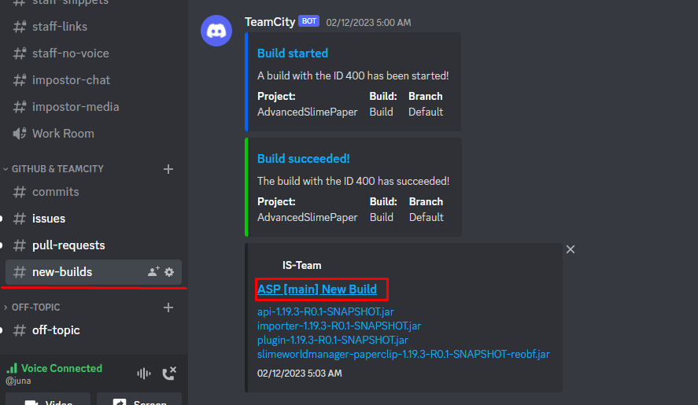

# Setup a devserver
It's possible to configure your plugins gradle setup to allow running a server with the plugin right out of your IDE via gradle. This can lead to an improved developer experience.


This guide assumes:
 - you are using `shadowJar` (`com.github.johnrengelman.shadow`)
 - the Kotlin DSL (`gradle.build.kts`)

To the top of your gradle file add the following two imports. It's fine for them to be marked as errors by your IDE for now.
```kt
import dev.s7a.gradle.minecraft.server.tasks.LaunchMinecraftServerTask
import java.io.FileOutputStream
```

Then you will need to add the server plugin to your plugins. ([Latest Version](https://github.com/sya-ri/minecraft-server-gradle-plugin))

```kt

plugins {
    // ...your other gradle plugins
    id("dev.s7a.gradle.minecraft.server") version "2.0.0" // always choose the latest version from the link above
}
```

At last add the following code to the file. It configures a minecraft server and automatically downloads the specified version of ASWM and AdvancedSlimePaper.
```kt
task<LaunchMinecraftServerTask>("runServer") {
    dependsOn("shadowJar")
    val slimeBuild = "INSERT BUILD VERSION"
    val slimeVersion = "1.19.3-R0.1"
    doFirst {
        copy {
            val file = tasks.named<AbstractArchiveTask>("shadowJar").flatMap { shadow -> shadow.archiveFile }.get().asFile;
            from(file)
            into(buildDir.resolve("MinecraftServer/plugins"))
        }

        val slimeJarFileOutput = buildDir.resolve("MinecraftServer/plugins/AdvancedSlimeManager.jar")
        uri(ASWM.plugin(slimeBuild, slimeVersion))
            .toURL().openStream().use { it.copyTo(FileOutputStream(slimeJarFileOutput)) }
    }

    jarUrl.set(ASWM.server(slimeBuild, slimeVersion))
    agreeEula.set(true)
}

class ASWM {
    companion object {
        fun server(build: String, version: String) : String {
            return "https://dl.rapture.pw/IS/ASP/main/${build}/slimeworldmanager-paperclip-${version}-SNAPSHOT-reobf.jar";
        }
        fun plugin(build: String, version: String) : String {
            return "https://dl.rapture.pw/IS/ASP/main/${build}/plugin-${version}-SNAPSHOT.jar";
        }
    }
}

```
**IMPORTANT** Don't forget to replace `INSERT BUILD VERSION` with a valid commit ID **from #new-build on our discord server** or github (looks like this `42175f090baf00494c0fb25588f1e22ad4d9558f` <-- don't use this version as its outdated)

Just click the highlighted link and copy the ID part.

